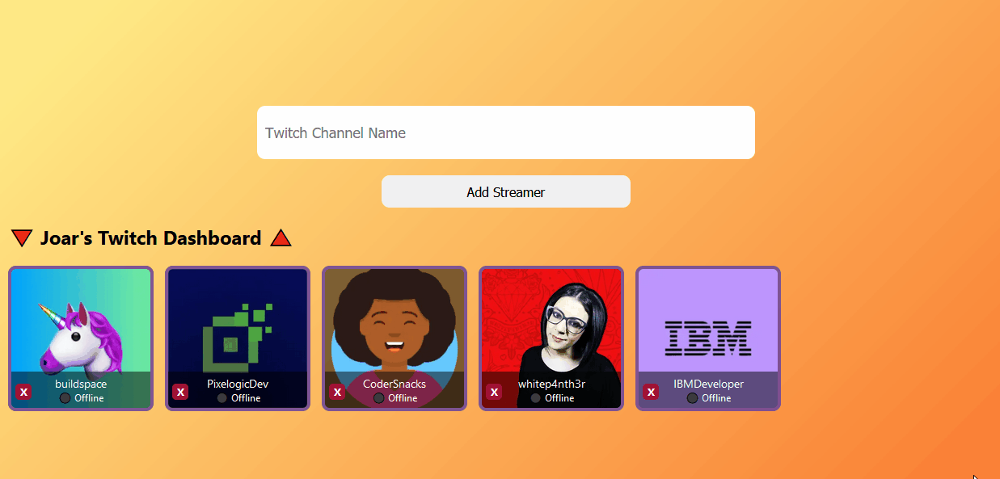
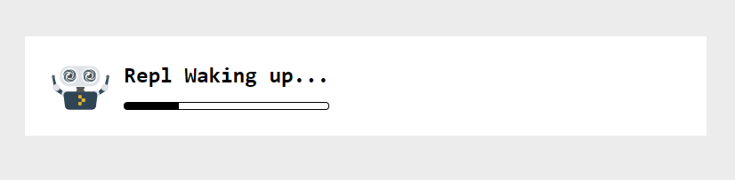

<h1 align="center">Personalized Twitch Dashboard ☑</h1>

    

---
## What is this?
>📌 Enter your favorite streamer name and enjoy your personalized twitch dashboard
---
## Where is the link?

Here's the link 👉 [**twitch-dashboard.joardev.repl.co**](https://twitch-dashboard.joardev.repl.co/)
---
## They give NFT as a course certificate?

Yes, Buildspace started this innitiative not too much ago. Here my NFT 👉 [**Buildspace: Build a Twitch Dashboard: Next.js + Twitch API | Cohort Alcor | #12**](https://opensea.io/assets/matic/0x3CD266509D127d0Eac42f4474F57D0526804b44e/276?force_update=true)

---
## What does this screen mean?

If you find this loading screen it is because replit doesnt have the website always running. 

Just wait a couple seconds.

---
## What is this repo about?

This repo contains the project that i created in the ["Build a Twitch Dashboard: Next.js + Twitch API"](https://buildspace.so/twitch-dashboard) course by Buildspace.

This is my first try at NEXT.js framework and Alec, the instructor, made the whole experience super fun.

The course were two weeks of twitch streams where Alec taught us how to deploy this website on replit, another awesome platform for coding.  It's literally an online IDE that has support for many languages.

---
## Tech Stack for this project

\

 

\
Credits for the badges to this awesome repo 👉 [Badges 4 README.md Profile](https://github.com/alexandresanlim/Badges4-README.md-Profile)

---
## My socials 👋 say hi

    
    
    

